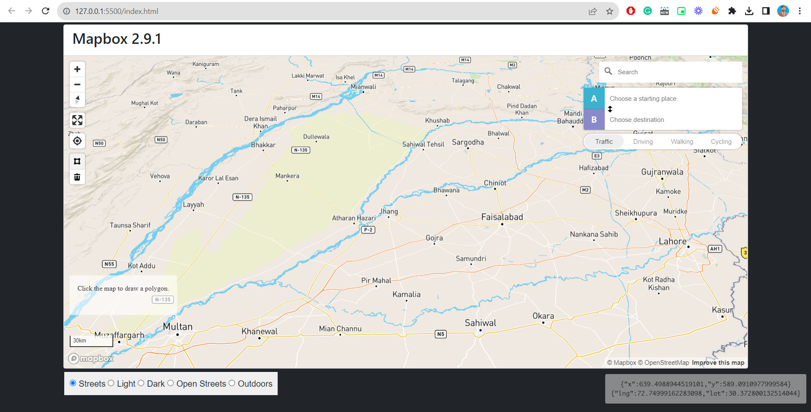

# Mapbox quick starter template
This is a Mapbox Starter template with many controls using ***HTML, CSS, Bootstrap 5 and Javascript (JS)***

This repository helps when you want to start using Mapbox immediately with many controls already added.
The following **controls** are already added to the Mapbox map. Feel free to customize it according to your usage.

- Zoom Controls
- User Location
- Distance Measurement
- Directions
- Mouse Coordinates
- Scale
- Basemaps
- Polygon Drawing & Area Measurement

 

 

Different ***CDNs*** are used for adding these controls.
__Don't forget to give credit to the original creators of all the controls and Mapbox.com.__

## 1. Mapbox CDN
    <!-- Mapbox 2.9.1 -->
  	
  	<link href="https://api.mapbox.com/mapbox-gl-js/v2.9.1/mapbox-gl.css" rel="stylesheet" />

## 2. Geocoder/ Geo Search
    <!-- CDN: Load the `mapbox-gl-geocoder` plugin. js -->
  	
  	<link rel="stylesheet"
  		href="https://api.mapbox.com/mapbox-gl-js/plugins/mapbox-gl-geocoder/v5.0.0/mapbox-gl-geocoder.css" type="text/css" />
  	<!-- CDN: Load the `mapbox-gl-geocoder` plugin. css -->

 ## 3. Distance measure CDN
    <!-- CDN: Draw & Distance measure-->
    

 ## 4. Draw Tool CDN
    <!-- CDN: Draw & Distance measure-->
    
    <!-- CDN: Draw js-->
    
    <link rel="stylesheet" href="https://api.mapbox.com/mapbox-gl-js/plugins/mapbox-gl-draw/v1.4.0/mapbox-gl-draw.css"
		  type="text/css" />

 ## 5. Directions CDN
    
    <link rel="stylesheet"
      href="https://api.mapbox.com/mapbox-gl-js/plugins/mapbox-gl-directions/v4.1.1/mapbox-gl-directions.css"
    type="text/css">

## 6. Export Map CDN
    <link href="https://watergis.github.io/mapbox-gl-export/mapbox-gl-export.css" rel="stylesheet" />
    

 

 